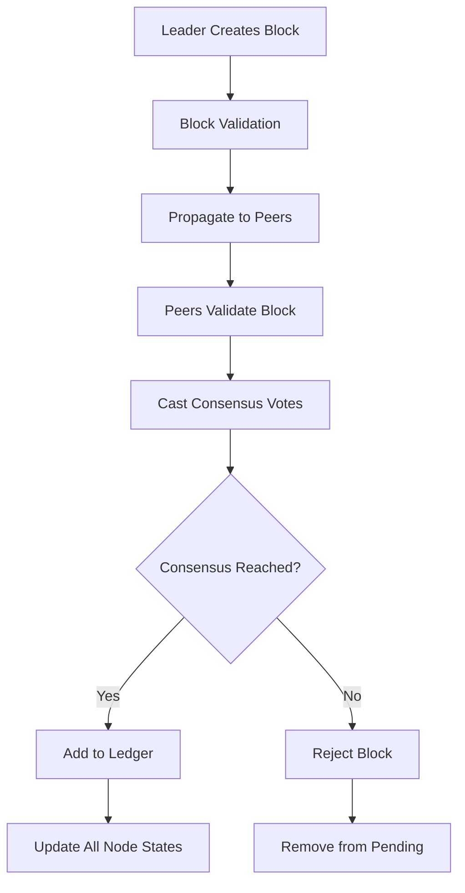

# P2P Block Propagation & Ledger Update System

This document describes the implementation of P2P block propagation, consensus-based ledger updates, and rollback handling for the Child Welfare Blockchain system.

## 🏗️ Architecture Overview

The system implements a distributed blockchain with the following key components:

### 1. P2P Network (`backend/p2p.js`)
- **WebSocket-based communication** between nodes
- **Block propagation** with validation tracking
- **Consensus voting** mechanism
- **Block synchronization** and request/response handling
- **Rollback notifications** across the network

### 2. Consensus Manager (`backend/consensus.js`)
- **Round-robin leader selection** among node roles (NGO, Government, Hospital, Auditor, Admin)
- **Block validation** with cryptographic verification
- **Consensus voting** with configurable threshold (default: 60%)
- **Ledger state management** for child welfare records
- **Rollback handling** with depth limits and history tracking

### 3. Server Integration (`backend/server.js`)
- **REST API endpoints** for block creation, ledger access, and rollback
- **P2P message handlers** for all consensus and propagation events
- **Real-time WebSocket** updates for clients

## 🔄 Block Propagation Flow



### Detailed Process:

1. **Block Creation**: Leader node creates a new block with pending transactions
2. **Initial Validation**: Leader validates the block before propagation
3. **P2P Propagation**: Block is broadcast to all connected peers
4. **Peer Validation**: Each peer validates the received block
5. **Consensus Voting**: Peers cast approve/reject votes
6. **Consensus Check**: System checks if threshold is met (60% approval)
7. **Ledger Update**: If consensus reached, block is added to all ledgers
8. **State Synchronization**: All nodes update their ledger state

## 📚 Ledger Update System

The ledger maintains the current state of all child welfare records:

### Record Types:
- **Create Record**: New child record created by NGO
- **Update Record**: Existing record updated by authorized entities
- **Transfer Guardianship**: Guardianship transferred by Government

### State Management:
```javascript
// Ledger state structure
{
    id: 'child_001',
    createdBy: 'NGO_001',
    createdAt: timestamp,
    data: { name, age, location, status },
    lastUpdatedBy: 'Hospital_001',
    lastUpdatedAt: timestamp,
    guardian: 'FosterFamily_001',
    blockIndex: 5
}
```

## 🔄 Rollback Handling

The system implements comprehensive rollback functionality:

### Rollback Triggers:
- Invalid block detected during validation
- Consensus failure after propagation
- Manual rollback request from admin

### Rollback Process:
1. **Detection**: Invalid block identified
2. **Depth Check**: Verify rollback doesn't exceed maximum depth (10 blocks)
3. **State Backup**: Store rollback history
4. **Block Removal**: Remove invalid block and all subsequent blocks
5. **Ledger Reconstruction**: Rebuild ledger state from remaining blocks
6. **Network Notification**: Broadcast rollback to all peers
7. **Peer Synchronization**: All peers apply the same rollback

### Safety Features:
- **Maximum rollback depth** to prevent excessive state loss
- **Rollback history** for audit and recovery
- **Network-wide synchronization** to maintain consistency

## 🚀 API Endpoints

### Block Management:
- `POST /block` - Create new block (leader only)
- `GET /blockchain` - Get current blockchain
- `POST /sync` - Synchronize with peer blockchain

### Ledger Access:
- `GET /ledger` - Get all child records
- `GET /ledger?childRecordId=xxx` - Get specific record
- `GET /consensus` - Get consensus statistics

### Rollback Operations:
- `POST /rollback` - Trigger rollback (admin only)
- `GET /rollback-history` - Get rollback history

### P2P Operations:
- `POST /request-block` - Request block from peer
- `GET /health` - Node health and statistics

## 🧪 Testing

### Test Scripts:
1. **`start_test_nodes.js`** - Start multiple test nodes
2. **`test_block_propagation.js`** - Comprehensive test suite

### Test Scenarios:
- Block creation and propagation
- Consensus voting and threshold checking
- Ledger state updates across nodes
- Rollback functionality
- Network synchronization

### Running Tests:
```bash
# Start test nodes
node start_test_nodes.js

# Run propagation tests
node test_block_propagation.js
```

## 📊 Monitoring and Statistics

### Health Endpoint (`/health`):
```json
{
  "status": "healthy",
  "nodeId": "node_abc123",
  "nodeRole": "NGO",
  "blockchainLength": 15,
  "currentLeader": "Government",
  "stats": {
    "consensus": {
      "pendingBlocks": 0,
      "consensusVotes": 3,
      "ledgerRecords": 25,
      "rollbackHistory": 1
    },
    "ledger": {
      "totalRecords": 25,
      "rollbackHistory": 1
    }
  }
}
```

### Consensus Statistics:
- Pending blocks awaiting consensus
- Active consensus votes
- Ledger record count
- Rollback history length

## 🔧 Configuration

### Consensus Settings:
```javascript
consensusThreshold: 0.6,        // 60% approval required
maxRollbackDepth: 10,           // Maximum blocks to rollback
```

### P2P Settings:
```javascript
p2pPort: serverPort + 1000,     // P2P communication port
maxPeers: 50,                   // Maximum connected peers
```

## 🛡️ Security Features

1. **Cryptographic Validation**: All blocks verified with SHA-256 hashes
2. **Digital Signatures**: Block signatures from leaders
3. **Merkle Tree Verification**: Transaction integrity checking
4. **Role-based Access**: Different permissions for different node types
5. **Consensus Protection**: Prevents single-point-of-failure attacks

## 🔮 Future Enhancements

1. **Dynamic Consensus Thresholds**: Adjust based on network conditions
2. **Advanced Rollback Strategies**: Partial rollbacks and state recovery
3. **Performance Optimization**: Parallel validation and propagation
4. **Network Topology Management**: Automatic peer discovery and connection
5. **Monitoring Dashboard**: Real-time visualization of network state

## 📝 Usage Examples

### Creating a Block:
```javascript
// Leader creates block with pending transactions
const response = await axios.post('http://localhost:3001/block');
console.log('Block created:', response.data.block);
```

### Checking Consensus:
```javascript
// Get consensus status
const consensus = await axios.get('http://localhost:3001/consensus');
console.log('Pending blocks:', consensus.data.stats.pendingBlocks);
```

### Triggering Rollback:
```javascript
// Rollback invalid block
const rollback = await axios.post('http://localhost:3001/rollback', {
    blockHash: 'invalid_block_hash'
});
console.log('Rollback result:', rollback.data.success);
```

This implementation provides a robust, distributed blockchain system specifically designed for child welfare record management with comprehensive block propagation, consensus mechanisms, and rollback capabilities.
